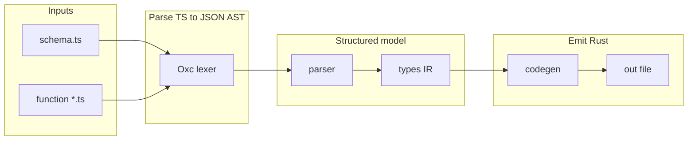

# convex-typegen — architecture

This document is for **contributors** who want to understand how the crate works end-to-end, where to change behavior, and what invariants must hold when improving parsing or codegen.

## Goals and constraints

- **Run at build time** (`build.rs`): read Convex TypeScript (`schema.ts` + function modules), emit a single Rust file (default `src/convex_types.rs`).
- **Stay dependency-light on the codegen path**: no `syn` / `quote` for output; Rust text is built with string formatting.
- **Stable public API**: small surface (`generate`, `Configuration`, `prelude`, re-exported `serde` / `serde_json`, `ConvexClientExt`). Almost everything interesting lives under the private `convex` module.

---

## End-to-end pipeline

High-level flow from [generate()](https://docs.rs/convex-typegen/latest/convex_typegen/fn.generate.html):

1. **`config::Configuration`** — Paths for schema, output file, Convex directory, and optional explicit `function_paths` (skips directory discovery).
2. **`fs::rcfp`** — Resolves which `.ts` files are treated as function sources (same set as `generate`, intended for `cargo:rerun-if-changed`).
3. **`convex::create_schema_ast`** — One file: canonical `schema_path` → ESTree JSON (`serde_json::Value`).
4. **`convex::create_function_asts`** — Many files: each path is canonicalized; ASTs are stored in a **`BTreeMap<String, JsonValue>`** keyed by **canonical path string** (stable iteration order, no basename collisions between `convex/a/foo.ts` and `convex/b/foo.ts`).
5. **`parser::parse_schema_ast`** / **`parser::parse_function_ast`** — Walk ESTree JSON into Rust structs + embedded JSON for column/param types.
6. **`codegen::run_codegen`** — Write header + generated Rust from `(ConvexSchema, ConvexFunctions)`.

Errors are unified as **`error::ConvexTypeGeneratorError`** (IO, Oxc parse/semantic failures, invalid schema shape, circular `v.object` patterns, invalid `v.*` names, etc.).

---

## Crate map (where to look)

| Area | Module / path | Responsibility |
|------|-----------------|------------------|
| Entry | `src/lib.rs` | `generate`, crate docs, `serde` / `serde_json` / `ConvexClientExt` re-exports |
| Config | `src/config.rs` | `Configuration` defaults |
| Discovery | `src/fs.rs` | `rcfp`, walk `convex/**/*.ts`, skip schema / `_generated` / `node_modules` / `*.d.ts` |
| TS → JSON AST | `src/convex/lexer.rs` | Oxc parse + semantic check → `to_estree_ts_json` → `serde_json::Value` |
| ESTree → IR | `src/convex/parser.rs` | `defineSchema` / `defineTable` / `v.*`; exported `query` / `mutation` / `action` + `args` |
| IR types | `src/convex/types.rs` | `ConvexSchema`, `ConvexTable`, `ConvexColumn`, `ConvexFunction`, … |
| Naming | `src/convex/utils.rs` | `capitalize_first_letter`, `to_pascal_case`, `validate_type_name` vs `VALID_CONVEX_TYPES`, nested object struct names |
| Validator IR | `src/convex/validator.rs` | `ConvexValidator`, `structName` / nesting depth cap for named objects |
| Oxc AST spike | `src/convex/ast.rs` | Direct `Program` walks for future JSON-path replacement (not on the production path) |
| Rust text | `src/convex/codegen.rs` | Named object structs, tables, union enums, `*Args` structs, `TryFrom` for Convex args |
| Client glue | `src/convex/mod.rs` | `IntoConvexValue`, `ConvexValueExt`, `ConvexClientExt`; `create_schema_ast`, `create_function_asts` |

---

## Phase 1 — TypeScript to ESTree JSON (`lexer.rs`)

### Why Oxc and not `tsc`?

The build must be **self-contained in Rust**: Oxc parses TypeScript/TSX, runs semantic checks, and can serialize the program to **ESTree-compatible JSON**. That JSON is what the rest of the crate consumes.

### Steps in `generate_javascript_ast`

1. Read source text; reject whitespace-only files (`EmptySchemaFile`).
2. **`SourceType::from_path`** — Infer TS vs TSX from extension; failure becomes `ParsingFailed`.
3. **Parser** — Collect diagnostics; if the parser **panicked**, return `ParsingFailed` with joined messages.
4. **Empty program** — Treated like empty file (`EmptySchemaFile`) for the “nothing to work with” case.
5. **`SemanticBuilder`** — `with_check_syntax_error(true)`; any semantic/syntax errors → `ParsingFailed` with joined Oxc diagnostics (and optional **`verbose`** feature to `eprintln!` full debug).
6. **`Program::to_estree_ts_json(false)`** — Oxc’s `Program` is not `Serialize`; this produces a JSON string, then **`serde_json::from_str`** turns it into `serde_json::Value`. Failures become `SerializationFailed`.

Files larger than **`lexer::MAX_SOURCE_BYTES`** (10 MiB) are rejected before parsing.

### Contributor notes

- **ESTree dialect**: Oxc may emit node kinds that differ from older Babel-centric tools (e.g. object literal fields as **`Property`** vs **`ObjectProperty`**). The parser must accept both where we match on `type` (see `parser::is_estree_object_property_like` and function `args` handling).
- **Switching `to_estree_js_json` vs `to_estree_ts_json`**: There is an in-code TODO; changing this is a compatibility risk—run the full test suite and real Convex projects before/after.

---

## Phase 2 — ESTree JSON to internal model (`parser.rs`)

The parser does **not** use a typed ESTree crate. It uses **ad hoc `serde_json::Value` indexing** (`ast["body"]`, `node["type"]`, …). That keeps dependencies low but means:

- Shape assumptions must match **Oxc’s JSON** exactly.
- When Oxc upgrades, **diff representative AST JSON** (or add regression tests with minimal synthetic trees—see existing unit tests).

### Schema (`parse_schema_ast`)

**Expected shape (conceptually):**

- Root: object with `"body": [ ... ]` (program statements).
- Find a **`CallExpression`** whose callee is the identifier **`defineSchema`**:
  - Either under `ExportDefaultDeclaration.declaration`, or as a top-level call (see `find_define_schema`).
- First argument: **`ObjectExpression`** whose `properties` are **tables**.
- Each table property’s `value`: a **`CallExpression`** chain whose base is **`defineTable`**, optionally followed by Convex builder calls (`.index`, `.searchIndex`, `.vectorIndex`). The parser peels that chain to the inner `defineTable` and reads the first argument as the object of **columns**.
- Each column property’s `value`: a **`CallExpression`** representing **`v.<validator>(...)`**:
  - The code reads **`value.callee.property.name`** as the Convex validator name (e.g. `string`, `optional`, `union`).
  - That name must be in **`VALID_CONVEX_TYPES`** or you get `InvalidType`.

**Normalized column / param type (`data_type`)**

Instead of a Rust enum per `v.*` variant, the parser builds a **small JSON object** per column/parameter:

- Always includes `"type": "<validator>"` (e.g. `"string"`, `"optional"`, `"union"`).
- Nested validators become nested keys: e.g. `"optional"` → `"inner"`, `"array"` → `"elements"`, `"object"` → `"properties"` map, `"record"` → `"keyType"` / `"valueType"`, `"union"` → `"variants"` array, `"literal"` → `"value"` payload.

**Why JSON inside Rust structs?**

- **Codegen** can pattern-match on `data_type["type"]` without a large hand-maintained mirror of every Convex validator edge case.
- **Downside**: invalid shapes surface as logic errors or `InvalidSchema` rather than compile-time exhaustiveness. Adding a new Convex validator usually means: extend `VALID_CONVEX_TYPES`, teach `extract_column_type`, then teach `convex_type_to_rust_type` / function arg emission.

**Cycles**

- Recursive `v.object` graphs are checked (`check_circular_references` + `TypeContext`) so pathological schemas fail with `CircularReference` instead of blowing the stack or looping silently.

### Functions (`parse_function_ast`)

- Input: **`BTreeMap`** from `create_function_asts` (deterministic order).
- Per file: take basename of path, strip `.ts` → Convex **module segment** (`file_name` field on `ConvexFunction`).
- Walk `body` for **`ExportNamedDeclaration`** → **`VariableDeclaration`** → declarator `init` is **`CallExpression`** with callee **`query` | `mutation` | `action`** (identifier name).
- First argument: config object; find property **`args`** whose value is an **`ObjectExpression`**. Each arg field is parsed with the **same `extract_column_type` pipeline** as schema columns.

**ESTree detail — `args` fields**

Function parameter object entries may be **`ObjectProperty`** or **`Property`**. Both must be accepted; otherwise codegen fails on valid Oxc output with “Invalid argument property structure”.

### Errors

Most failures are **`InvalidSchema { context, details }`**. When extending the parser, prefer **specific `details` strings** so `build.rs` panics are actionable.

---

## Phase 3 — Intermediate representation (`types.rs`)

| Type | Role |
|------|------|
| `ConvexSchema` | `tables: Vec<ConvexTable>` |
| `ConvexTable` | `name`, `columns` |
| `ConvexColumn` | `name`, `data_type: JsonValue` — normalized `v.*` tree |
| `ConvexFunction` | `name`, `params`, `type_` (`query` / …), `file_name` (module segment) |
| `ConvexFunctionParam` | `name`, `data_type: JsonValue` |
| `ConvexFunctions` | Type alias for `Vec<ConvexFunction>` |
| `ConvexValidator` (`validator.rs`) | Typed `v.*` tree used for named-object hashing/dedupe; parser JSON remains the source of truth |

Parser output stays JSON; codegen reads `structName` off that JSON. `ConvexValidator::from_json` is the typed view.

`ConvexSchema` / `ConvexFunction` derive `Serialize`/`Deserialize` mainly for **tests** and potential tooling—not required for normal `generate`.

---

## Phase 4 — Code generation (`codegen.rs`)

### Design

- **String concatenation** into a `String` buffer, then write file. No proc-macro / `syn` pipeline.
- Emitted file starts with a **fixed header**: allows, `use convex_typegen::prelude::*`, etc.

### Emission order (`run_codegen`)

1. **`collect_named_structs` / `emit_named_struct_definitions`** — Two-pass: gather `v.object` shapes with `structName` from the parser, dedupe by name + field types, emit `pub struct` with serde derives first.
2. **`generate_table_enums`** — For each column that is `v.union` (or `v.optional(v.union(...))`), emit a Rust `enum` **before** table structs so types are in scope.
3. **`generate_table_code`** — `pub struct {Table}Table { ... }` with fields derived from `convex_type_to_rust_type`.
4. **`generate_function_code`** — For each `ConvexFunction`, emit `{Module}{Export}Args` (see naming below), `FUNCTION_PATH`, serde derives, and **`TryFrom<...> for BTreeMap<String, ConvexJsonValue>`**. Duplicate qualified struct names return **`InvalidSchema`**.

### `convex_type_to_rust_type`

Maps the **normalized JSON** from the parser to Rust type strings used in generated source:

- Scalars: `string` → `String`, `number` → `f64`, `boolean` → `bool`, etc.
- **`v.object`**: When the parser attached **`structName`**, emit that struct type. Otherwise, if all property types are identical, emit `BTreeMap<String, T>`; if heterogeneous or empty, emit **`ConvexJsonValue`**. Conflicting shapes under the same `structName` fail codegen with **`InvalidSchema`**.
- **`v.optional`**: `Option<...>`; if inner is **`union`** and table/field context is known, use generated enum name `{Table}Optional{Field}` for optional unions.
- **`v.union`**: Enum name `{Table}{Field}` (see codegen module docs for collision avoidance).

### Function args — Convex `v.optional` vs JSON `null`

Convex treats **`v.optional`** as “key may be **absent**”, not “key may be **`null`**”. Serde’s `Option::None` serializes to JSON `null` by default, which **fails Convex validation**.

So for root-level optional parameters, generated `TryFrom` **omits the map key** when the Rust field is `None` (`convex_arg_root_is_optional` gates this). Contributors adding new serialization paths must preserve this invariant for optional args.

### Naming (`utils.rs`)

- **`function_args_struct_name`**: `{Module}{Export}Args` unless the export already starts with the PascalCase module segment (`tasks` + `tasksSearch` → `TasksSearchArgs`; `games` + `getGame` → `GamesGetGameArgs`).
- **Nested object structs**: `schema_column_object_struct_name`, `function_args_struct_stem` + param field, `nested_object_struct_name` for deeper nesting (depth capped by `validator::MAX_OBJECT_NEST_DEPTH`).
- **`capitalize_first_letter`**: table/field → struct/enum name segments (`games` → `Games`).
- **`to_pascal_case`**: module file segments and union variants (`mod_a` → `ModA`, `draft` → `Draft`).

See [semver-policy.md](semver-policy.md) for when generated type renames require a crate version bump. Keep naming **stable** and **collision-free** when changing algorithms—users rely on generated type names in application code.

---

## Runtime helpers (`convex/client.rs`, feature `client`)

With the default **`client`** feature, these exist for **downstream crates** that call Convex with generated types:

- **`IntoConvexValue`** — `serde_json::Value` → `convex::Value` (used after args are JSON-shaped).
- **`ConvexValueExt`** — `convex::Value` → `serde_json::Value` (lossy for some kinds, e.g. bytes → JSON array of numbers).
- **`ConvexClientExt::prepare_args`** — `TryFrom` args struct → `BTreeMap<String, convex::Value>`; errors are `serde_json::Error` when JSON conversion fails.

`generate` itself does **not** use the Convex network client; these traits bridge the official **`convex`** crate at runtime.

---

## Testing strategy (for contributors)

- **Unit tests** live next to modules under `#[cfg(test)]` and cover:
  - Synthetic ESTree-shaped JSON for `parse_schema_ast` / `parse_function_ast`.
  - Lexer edge cases (empty file, invalid TS).
  - Codegen string properties (`TryFrom` optional branch, `convex_type_to_rust_type` cases).
- **Integration tests** in `tests/golden_generate.rs` and `tests/build_script_smoke.rs` run the full pipeline in `tempfile` directories with inline TypeScript fixtures.
- **Golden snapshots** (`insta`) guard stable codegen output for minimal schema/function and cross-module duplicate exports.

When changing parser assumptions, **add or adjust a minimal JSON fixture** in tests before touching production code when possible.

---

## Common extension points

| Goal | Likely touch points |
|------|---------------------|
| New Convex `v.*` validator | `VALID_CONVEX_TYPES`, `extract_column_type`, `convex_type_to_rust_type`, tests |
| New AST shape from Oxc | `lexer` (if serialization changes), `parser` field access, tests |
| Different Rust mapping for objects / unions | `codegen::convex_type_to_rust_type`, enum emission |
| Named nested object structs | `parser` `structName`, `validator.rs`, `codegen::collect_named_structs` |
| Optional / null semantics elsewhere | Any new `TryFrom` or serde paths must align with Convex validation rules |

---

## Related files

- **`readme.md`** — User-facing setup (also included in rustdoc via `lib.rs`).
- **`CHANGELOG.md`** — Notable behavior changes (e.g. named `v.object` structs, optional-arg omission in `TryFrom`).
- **`docs/semver-policy.md`**, **`docs/api-stability.md`** — versioning and public-API contract.
- **`docs/oxc-ast-evaluation.md`** — JSON vs direct Oxc AST tradeoffs.

If you add major pipeline stages, update this document so the next contributor does not have to reconstruct intent from git history alone.
