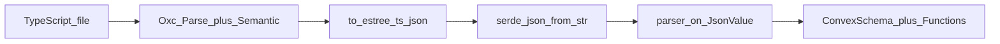

# Oxc AST evaluation (Phase 2)

**Decision: Hybrid path (B)** — keep ESTree JSON for validator extraction in the short term; add direct `Program` walks incrementally for structural facts (exports, `defineSchema` location) when we migrate.

**Status:** Spike landed in [`src/convex/ast.rs`](../src/convex/ast.rs) (`extract_program_facts`, benchmark test). Production parsing still uses [`lexer.rs`](../src/convex/lexer.rs) → JSON → [`parser.rs`](../src/convex/parser.rs).

## Current pipeline

Bottleneck: serialize entire `Program` to a string, allocate a second tree as `serde_json::Value`, then walk ~57 JSON field paths in `parser.rs`.

## Spike results

| Approach | What we measured | Observation |
| --- | --- | --- |
| JSON path | `generate_javascript_ast` on `examples/advanced/convex/schema.ts` | Full fidelity today; higher alloc + parse cost |
| Direct walk | `extract_program_facts` (export/call counts) | No JSON alloc; needs full port of `parser.rs` logic to Oxc nodes |

The `benchmark_json_vs_direct_on_advanced_schema` test in `ast.rs` prints wall times for 50 iterations (stderr). Direct walk is cheaper for **structural** queries but does not yet produce `ConvexSchema` / `ConvexFunctions`.

## Risk register

| Risk | Mitigation |
| --- | --- |
| **Allocator lifetimes** — `Program` tied to `Allocator` | Per-file parse + extract in one pass (likely **better** memory than storing `BTreeMap<String, JsonValue>`) |
| **Oxc version churn** | Pin `oxc` minor; golden + unit tests |
| **ESTree vs Oxc nodes** | Keep JSON fixtures during migration; dual-run tests |
| **`to_estree_js_json` vs `to_estree_ts_json`** | Re-evaluate when porting; TS JSON is sufficient for Convex TS sources today |

## Recommended migration (if proceeding)

1. Introduce `parse_program(program) -> (schema fragment, functions)` without changing public API.
2. Dual-run behind `#[cfg(feature = "oxc_ast")]` or internal flag; compare IR in tests.
3. Switch default; remove `to_estree_ts_json` + JSON parser paths.
4. Shrink `parser.rs` JSON tests → AST helpers or IR snapshots.

## Outcomes considered

| Option | Verdict |
| --- | --- |
| **A — Full AST migration** | Best long-term perf; largest effort (2–3 weeks) |
| **B — Hybrid** | **Chosen** — AST for structure, JSON/normalized validators until typed IR is stable |
| **C — Defer** | Rejected for this roadmap; spike still documents tradeoffs |

Named nested structs (Phase 3) do **not** require AST migration; they use `structName` on validator JSON / [`validator.rs`](../src/convex/validator.rs).
